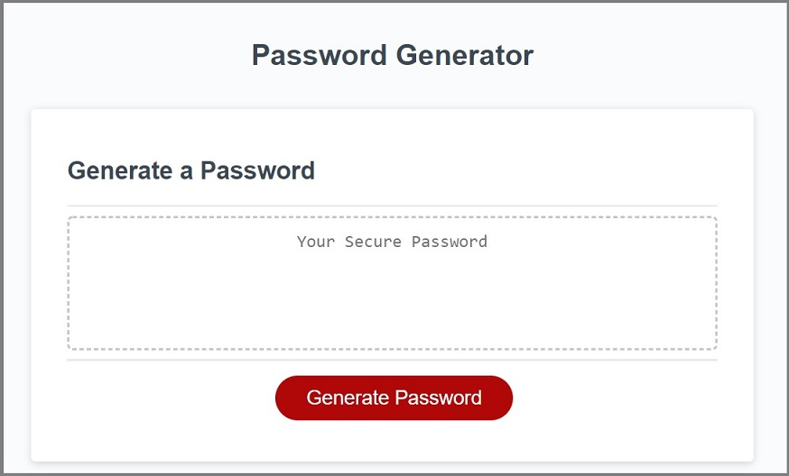
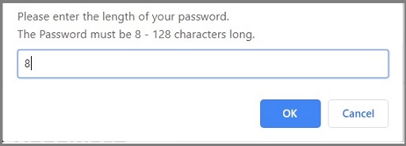
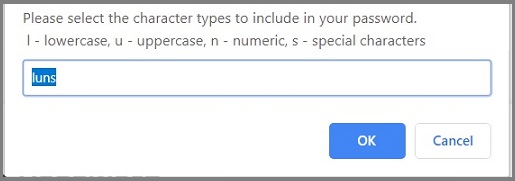

# JavaScript Password Generator

 

## Description
This application generates a random password based on user-selected criteria. Users can choose the password length and the type of characters to be used while generating the password. The newly generated password is then displayed on the screen. 

## Features
### Strong Password 
This application generates a strong password based on user-selected criteria. Using a strong password provides users with greater security when they need to access sensitive data. This application uses javascript to generate the strong password, and dynamically update HTML elements.

### Responsive Web Design 
This application is built using Responsive web design principles. Responsive web design provides better accessibility and an optimal viewing experience to the user, by ensuring that web pages render well on different devices and window / screen sizes. This has been achieved with the use of CSS to style HTML elements.

## Functionality

The Password Generator page contains a form that allows users to generate a strong password. When the user clicks the *Generate Password* button, the application prompts the user to enter the length of the desired password.

#### Password Length Selection

* The password length must be between 8 and 128 characters. 
* A default password length of 8 is displayed initially, and the user can then edit this.
* Once a password has been generated, the password length defaults to the user's last selection. 
* If the user enters an invalid length, the user is prompted to correct the entry and an *Incorrect selection !!* message is displayed.
* If the user chooses to cancel the operation, the prompt exits without generating a password. 

Once the password length has been selected, the application then prompts the user to choose the character types to be included in the desired password.

#### Password Character Types Selection

* The user needs to enter the password character types from a selection of lowercase(l), uppercase(u), numeric(n), and special characters(s). 
* By default all the password character types are selected initially, and the user can then edit this.
* Once a password has been generated, the password character type defaults to the user's last selection. 
* If the user enters an invalid selection or does not choose at least one type, the user is prompted to correct the entry and an *Incorrect selection !!* message is displayed.
* If the user chooses to cancel the operation, the prompt exits without generating a password. 

Once the password character types has been selected, the application then generates a password that matches the selected criteria and then displays it in the box above the *Generate Password* button, on the main page. 